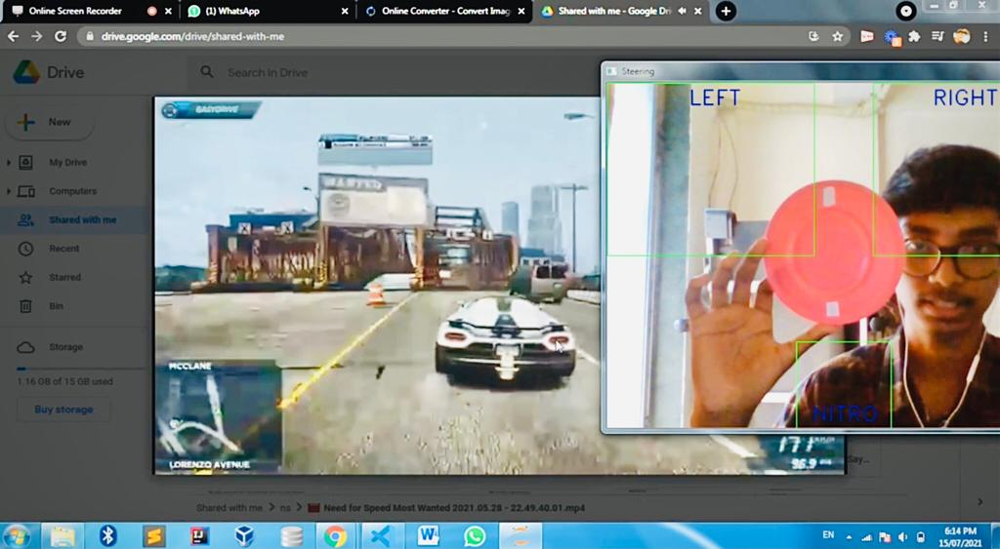

## "The Next Generation Artificial Intelligence based Virtual Steering Wheel"

  
  
  

  
  
  

### ~ A Fully Fledged, Automated Recognition and Detection System.
----

- 
The Devotion and Love for Video Games have increased tremendously in the past 5 years. Everybody wants to experience this virtual world. There are various types of games available for the racing category but all of them can only be controlled using button controllers which has their own cost and maintenance to use for a long period of time. The proposed model works as an automated system that uses motion control technology to get rid of button-mashing controllers and so their costs. This motion control technology is capable to make your gaming virtual Car turn left, right and accelerate so there will be no need for any single button. The player has to hold a circle/spherical flat object in the hand and according to the hand movements, this motion control system will respond correspondingly and move the virtual object in the desired direction on the screen. The idea is to create a Next Gen Hassle-Free Car Driving Experience Without Any Buttons.

- According to the proposed method, given an image in grayscale, the proposed methodology looks at many smaller subregions and tries to detect the object by looking at specific points in each subregion. It also needs to check many different positions and scales because an object may be of different sizes and may contain a circle, spherical object of various sizes. The proposed approach uses computer vision to maintain a secure environment. During the training stage, it is trained with the custom points and when a particular point is detected in any of the green colour parts(Left, Right, Nitro) a key is pressed accordingly.
  
- The cost of equipment will be $0. Any circle/ spherical flat object can be used to operate the game. The system will track the object automatically & set the parameter of its movements then it will accurately detect the object movements and correspondingly move the car on the screen in real-time. 

----

<h1 align="center">Output Screen</h1>

----

#### Implemented Features Overview:

- [x] Accuracy of Object detection is increased.
- [x] Understands the Object Pose change.
- [x] Scaling factor (i.e. size of the image)
- [x] Presence and absence of objects etc.
- [x] Overcomes “failure to enroll or template” (FTE).
- [x] The Model can be operated from farther distances.
---

